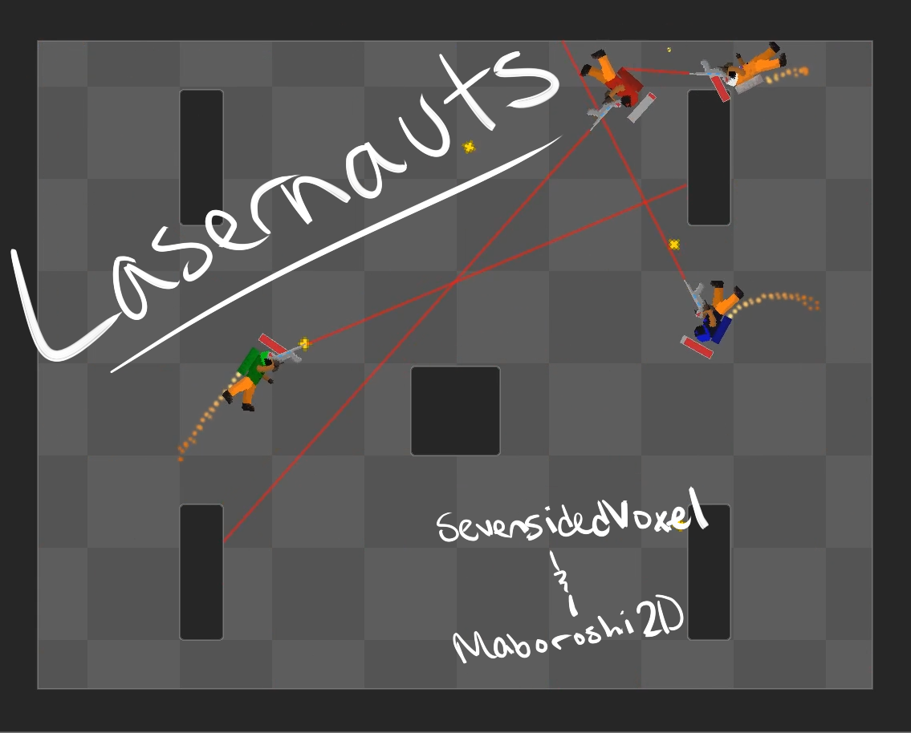

# [Play Lazernauts now!](https://sevensidedvoxel.itch.io/lazernauts)

**Thrust yourself through ten space arenas all while destroying up to three of your friends!**
Our game is a zany mashup of an arena shooter and uh... nothing... (That counts as incompatible, right?)
Created for [Ludum Dare 41 (Jam)](https://ldjam.com/events/ludum-dare/41/). Theme: **Combine 2 Incompatible Genres**

## Team
- [**SevenSidedVoxel**](https://github.com/sevensidedvoxel)
- [**Maboroshi2D**](https://github.com/maboroshi2d)

## Controls - Controller (Recommended)
- **Rotate**: Left Stick
- **Thrust Forward**: Left Bumper
- **Aim**: Right Stick
- **Shoot**: Right Bumper
- **Super Thrust**: "A" Button (rams enemies and does damage!)
- Note the menus still require the mouse

## Controls - Keyboard
- **Rotate**: A and D
- **Thrust Forward**: W
- **Aim**: Mouse
- **Shoot**: Left Mouse Button
- **Super Thrust**: Left Shift (rams enemies and does damage!)

## Tools
- Game Engine: [Unity](https://unity3d.com/)
- Music: [LMMS](https://lmms.io/)
- Art: [PyxelEdit](http://pyxeledit.com/)
- Art: [Paint.NET](https://www.getpaint.net/download.html)
- Art: [PaintTool SAI](https://www.systemax.jp/en/sai/)
- Source Control: [Git](https://git-scm.com/)
- Programming: [Visual Studio Community](https://www.visualstudio.com/vs/community/)
- Programming: [Visual Studio Code](https://code.visualstudio.com/)
